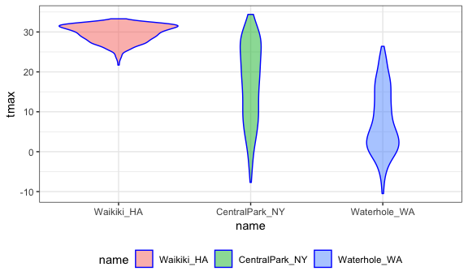

Strings and Factors
================
Marisa Sobel
10/16/2018

### Regex

``` r
string_vec = c("my", "name", "is", "mo")

str_detect(string_vec, "mo")
## [1] FALSE FALSE FALSE  TRUE
str_detect(string_vec, "Mo")
## [1] FALSE FALSE FALSE FALSE

str_replace(string_vec, "mo", "Mo")
## [1] "my"   "name" "is"   "Mo"
```

begins with, ends with

``` r
string_vec = c(
  "i think we all rule for participating",
  "i think i have been caught",
  "i think this will be quite fun actually",
  "it will be fun, i think"
  )

# ^ at beginning = begin with 
str_detect(string_vec, "^i think")
## [1]  TRUE  TRUE  TRUE FALSE

# $ at end = ends with
str_detect(string_vec, "i think$")
## [1] FALSE FALSE FALSE  TRUE
```

looking for matches

``` r
string_vec = c(
  "Y'all remember Pres. HW Bush?",
  "I saw a green bush",
  "BBQ and Bushwalking at Molonglo Gorge",
  "BUSH!!"
  )

# [ ] = multiple options for a match 
str_detect(string_vec,"[Bb]ush")
## [1]  TRUE  TRUE  TRUE FALSE
```

find pattern: starts with, followed by

``` r
string_vec = c(
  '7th inning stretch',
  '1st half soon to begin. Texas won the toss.',
  'she is 5 feet 4 inches tall',
  '3AM - cant sleep :('
  )

# starts with, followed by
str_detect(string_vec, "^[0-9][a-zA-Z]")
## [1]  TRUE  TRUE FALSE  TRUE
```

special symbol “.” = anything

``` r
string_vec = c(
  'Its 7:11 in the evening',
  'want to go to 7-11?',
  'my flight is AA711',
  'NetBios: scanning ip 203.167.114.66'
  )

# 7 followed by ANYTHING followed by 11
str_detect(string_vec, "7.11")
## [1]  TRUE  TRUE FALSE  TRUE

string_vec = c(
  'The CI is [2, 5]',
  ':-]',
  ':-[',
  'I found the answer on pages [6-7]'
  )

# use \ to search for special characters 
str_detect(string_vec, "\\[")
## [1]  TRUE FALSE  TRUE  TRUE
```

### PULSE data

Tidy PULSE data

``` r
pulse_data = haven::read_sas("./data/public_pulse_data.sas7bdat") %>%
  janitor::clean_names() %>%
  gather(key = visit, value = bdi, bdi_score_bl:bdi_score_12m) %>%
  mutate(visit = str_replace(visit, "bdi_score_", ""),
         visit = str_replace(visit, "bl", "00m"),
         visit = fct_relevel(visit, str_c(c("00", "01", "06", "12"), "m"))) %>%
  arrange(id, visit)
## Warning: attributes are not identical across measure variables;
## they will be dropped
```

### NSDUH

``` r
url = "http://samhda.s3-us-gov-west-1.amazonaws.com/s3fs-public/field-uploads/2k15StateFiles/NSDUHsaeShortTermCHG2015.htm"
drug_use_xml = read_html(url)

table_marj = (drug_use_xml %>% html_nodes(css = "table")) %>% 
  .[[1]] %>%
  html_table() %>%
  slice(-1) %>%
  as_tibble()
```

clean up imported data

``` r
data_marj = 
  table_marj %>%
  select(-contains("P Value")) %>%
  gather(key = key, value = percent, -State) %>%
  separate(key, into = c("age", "year"), sep = "\\(") %>%
  mutate(year = str_replace(year, "\\)", ""),
         percent = str_replace(percent, "[a-c]$", ""),
         percent = as.numeric(percent)) %>%
  filter(!(State %in% c("Total U.S.", "Northeast", "Midwest", "South", "West")))
```

making plots with that tidy data

``` r
# order of factor variable!
data_marj %>%
  filter(age == "12-17") %>% 
  mutate(State = fct_reorder(State, percent)) %>% 
  ggplot(aes(x = State, y = percent, color = year)) + 
    geom_point() + 
    theme(axis.text.x = element_text(angle = 90, hjust = 1))
```


### Fators…

``` r
# automatically chooses alphabetical as order
vec_sex = factor(c("male", "male", "female", "female"))
as.numeric(vec_sex)
## [1] 2 2 1 1

# set refrence group --> shift underlying ordering of variabels 
vec_sex = relevel(vec_sex, ref = "male")
vec_sex
## [1] male   male   female female
## Levels: male female
as.numeric(vec_sex)
## [1] 1 1 2 2
```

### Weather data

``` r
weather_df = 
  rnoaa::meteo_pull_monitors(c("USW00094728", "USC00519397", "USS0023B17S"),
                      var = c("PRCP", "TMIN", "TMAX"), 
                      date_min = "2017-01-01",
                      date_max = "2017-12-31") %>%
  mutate(
    name = recode(id, USW00094728 = "CentralPark_NY", 
                      USC00519397 = "Waikiki_HA",
                      USS0023B17S = "Waterhole_WA"),
    tmin = tmin / 10,
    tmax = tmax / 10) %>%
  select(name, id, everything())
weather_df
## # A tibble: 1,095 x 6
##    name           id          date        prcp    tmax  tmin
##    <chr>          <chr>       <date>     <dbl>   <dbl> <dbl>
##  1 CentralPark_NY USW00094728 2017-01-01    0.   8.90   4.40
##  2 CentralPark_NY USW00094728 2017-01-02   53.   5.00   2.80
##  3 CentralPark_NY USW00094728 2017-01-03  147.   6.10   3.90
##  4 CentralPark_NY USW00094728 2017-01-04    0.  11.1    1.10
##  5 CentralPark_NY USW00094728 2017-01-05    0.   1.10  -2.70
##  6 CentralPark_NY USW00094728 2017-01-06   13.   0.600 -3.80
##  7 CentralPark_NY USW00094728 2017-01-07   81.  -3.20  -6.60
##  8 CentralPark_NY USW00094728 2017-01-08    0.  -3.80  -8.80
##  9 CentralPark_NY USW00094728 2017-01-09    0.  -4.90  -9.90
## 10 CentralPark_NY USW00094728 2017-01-10    0.   7.80  -6.00
## # ... with 1,085 more rows
```

``` r
weather_df %>% 
  mutate(name = factor(name))
## # A tibble: 1,095 x 6
##    name           id          date        prcp    tmax  tmin
##    <fct>          <chr>       <date>     <dbl>   <dbl> <dbl>
##  1 CentralPark_NY USW00094728 2017-01-01    0.   8.90   4.40
##  2 CentralPark_NY USW00094728 2017-01-02   53.   5.00   2.80
##  3 CentralPark_NY USW00094728 2017-01-03  147.   6.10   3.90
##  4 CentralPark_NY USW00094728 2017-01-04    0.  11.1    1.10
##  5 CentralPark_NY USW00094728 2017-01-05    0.   1.10  -2.70
##  6 CentralPark_NY USW00094728 2017-01-06   13.   0.600 -3.80
##  7 CentralPark_NY USW00094728 2017-01-07   81.  -3.20  -6.60
##  8 CentralPark_NY USW00094728 2017-01-08    0.  -3.80  -8.80
##  9 CentralPark_NY USW00094728 2017-01-09    0.  -4.90  -9.90
## 10 CentralPark_NY USW00094728 2017-01-10    0.   7.80  -6.00
## # ... with 1,085 more rows
```

``` r
# set levels in relevel
weather_df %>%
  mutate(name = forcats::fct_relevel(name, c("Waikiki_HA", "CentralPark_NY", "Waterhole_WA"))) %>% 
  ggplot(aes(x = name, y = tmax)) + 
  geom_violin(aes(fill = name), color = "blue", alpha = .5) + 
  theme(legend.position = "bottom")
## Warning: Removed 3 rows containing non-finite values (stat_ydensity).
```



``` r

# set level according to median of 2nd variable
weather_df %>%
  mutate(name = forcats::fct_reorder(name, tmax)) %>% 
  ggplot(aes(x = name, y = tmax)) + 
  geom_violin(aes(fill = name), color = "blue", alpha = .5) + 
  theme(legend.position = "bottom")
## Warning: Removed 3 rows containing non-finite values (stat_ydensity).
```


ordering for linear model

``` r
weather_df %>%
  lm(tmax ~ name, data = .)
## 
## Call:
## lm(formula = tmax ~ name, data = .)
## 
## Coefficients:
##      (Intercept)    nameWaikiki_HA  nameWaterhole_WA  
##           17.366            12.291            -9.884

weather_df %>%
  mutate(name = forcats::fct_relevel(name, c("Waikiki_HA", "CentralPark_NY", "Waterhole_WA"))) %>% 
  lm(tmax ~ name, data = .)
## 
## Call:
## lm(formula = tmax ~ name, data = .)
## 
## Coefficients:
##        (Intercept)  nameCentralPark_NY    nameWaterhole_WA  
##              29.66              -12.29              -22.18
```

### NYC restaurant inspection

``` r
data(rest_inspec)

rest_inspec %>% 
  group_by(boro, grade) %>% 
  summarize(n = n()) %>% 
  spread(key = grade, value = n)
```

    ## # A tibble: 6 x 8
    ## # Groups:   boro [6]
    ##   boro              A     B     C `Not Yet Graded`     P     Z `<NA>`
    ##   <chr>         <int> <int> <int>            <int> <int> <int>  <int>
    ## 1 BRONX         13688  2801   701              200   163   351  16833
    ## 2 BROOKLYN      37449  6651  1684              702   416   977  51930
    ## 3 MANHATTAN     61608 10532  2689              765   508  1237  80615
    ## 4 Missing           4    NA    NA               NA    NA    NA     13
    ## 5 QUEENS        35952  6492  1593              604   331   913  45816
    ## 6 STATEN ISLAND  5215   933   207               85    47   149   6730

``` r
# filtering
rest_inspec =
  rest_inspec %>%
  filter(grade %in% c("A", "B", "C"), boro != "Missing") %>% 
  mutate(boro = str_to_title(boro))
```

focusing on
pizza…

``` r
# str_detect not working in our favor...being too precise, need to open it up 
rest_inspec %>% 
  filter(str_detect(dba, "Pizza")) %>% 
  group_by(boro, grade) %>% 
  summarize(n = n()) %>% 
  spread(key = grade, value = n)
```

    ## # A tibble: 5 x 3
    ## # Groups:   boro [5]
    ##   boro              A     B
    ##   <chr>         <int> <int>
    ## 1 Bronx             9     3
    ## 2 Brooklyn          6    NA
    ## 3 Manhattan        26     8
    ## 4 Queens           17    NA
    ## 5 Staten Island     5    NA

``` r
# making it more open
rest_inspec %>% 
  filter(str_detect(dba, "[Pp][Ii][Zz][Zz][Aa]")) %>% 
  group_by(boro, grade) %>% 
  summarize(n = n()) %>% 
  spread(key = grade, value = n)
```

    ## # A tibble: 5 x 4
    ## # Groups:   boro [5]
    ##   boro              A     B     C
    ##   <chr>         <int> <int> <int>
    ## 1 Bronx          1170   305    56
    ## 2 Brooklyn       1948   296    61
    ## 3 Manhattan      1983   420    76
    ## 4 Queens         1647   259    48
    ## 5 Staten Island   323   127    21

``` r
# visualize in bar plot
rest_inspec %>% 
  filter(str_detect(dba, "[Pp][Ii][Zz][Zz][Aa]")) %>%
  ggplot(aes(x = boro, fill = grade)) + 
  geom_bar() + 
  scale_fill_viridis(discrete = TRUE)
```


``` r
# reorder - put staten island first, do nothing with rest
rest_inspec %>% 
  filter(str_detect(dba, "[Pp][Ii][Zz][Zz][Aa]")) %>% 
  mutate(boro = fct_relevel(boro, "Staten Island")) %>% 
  ggplot(aes(x = boro, fill = grade)) + 
  geom_bar() + 
  scale_fill_viridis(discrete = TRUE)
```


``` r
# reorder - by infrequent 
rest_inspec %>% 
  filter(str_detect(dba, "[Pp][Ii][Zz][Zz][Aa]")) %>% 
  mutate(boro = fct_infreq(boro)) %>% 
  ggplot(aes(x = boro, fill = grade)) + 
  geom_bar() + 
  scale_fill_viridis(discrete = TRUE)
```


change factor values

``` r
rest_inspec %>% 
  filter(str_detect(dba, "[Pp][Ii][Zz][Zz][Aa]")) %>% 
  mutate(boro = fct_infreq(boro), 
         boro = fct_recode(boro, "HipsterHQ" = "Brooklyn")) %>% 
  ggplot(aes(x = boro, fill = grade)) + 
  geom_bar() + 
  scale_fill_viridis(discrete = TRUE)
```


